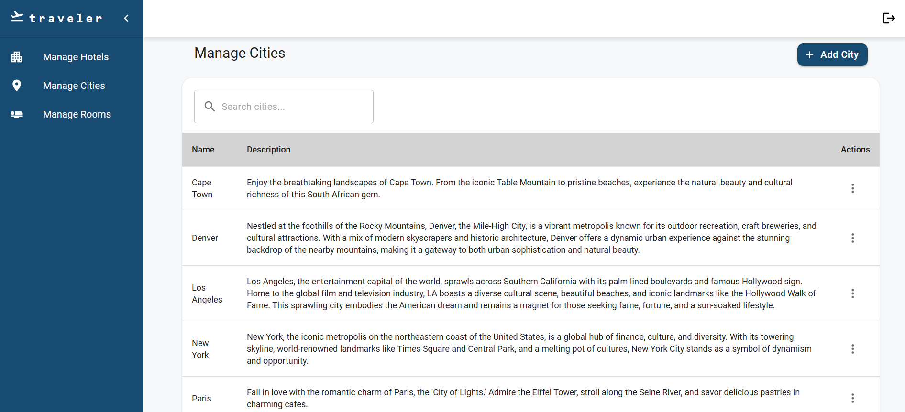

# traveler✈️

Welcome to traveler! Your go-to platform for booking travel accommodations. Effortlessly discover and reserve the most comfortable and secure stays, from cozy bed-and-breakfasts to upscale resorts, ensuring your journey is both unforgettable and worry-free. Experience stress-free booking and embark on your next adventure with traveler!

## Technologies

In this project, I've used the following libraries:

- **[`react`](https://reactjs.org/)**: A JavaScript library for building user interfaces.  
- **[`react-dom`](https://reactjs.org/docs/react-dom.html)**: Entry point of the DOM-related rendering paths.  
- **[`react-router-dom`](https://reactrouter.com/web/guides/quick-start)**: DOM bindings for React Router.  
- **[`mui/material`](https://mui.com/material-ui/)**: Material UI components for rich UI design.  
- **[`@mui/icons-material`](https://mui.com/material-ui/material-icons/)**: Material Icons for Material UI.  
- **[`@mui/x-date-pickers`](https://mui.com/x/react-date-pickers/)**: Material UI date pickers for date selection.  
- **[`formik`](https://formik.org/)**: Forms in React, without the tears.  
- **[`yup`](https://github.com/jquense/yup)**: Dead simple object schema validation.  
- **[`jwt-decode`](https://github.com/auth0/jwt-decode)**: Decode JWT tokens, mostly useful for browser applications.  
- **[`html2canvas`](https://html2canvas.hertzen.com/)**: Capture screenshots of DOM elements as canvas.  
- **[`jspdf`](https://github.com/parallax/jsPDF)**: Generate PDF files in JavaScript.  
- **[`date-fns`](https://date-fns.org/)**: A modern JavaScript date utility library for parsing, formatting, and manipulating dates.  
- **[`@vis.gl/react-google-maps`](https://visgl.github.io/react-map-gl/)**: React bindings for integrating Google Maps.  
- **[`jest-preview`](https://www.npmjs.com/package/jest-preview)**: Preview Jest snapshots in a browser.  
- **[`cra-template-typescript`](https://github.com/facebook/create-react-app/tree/main/packages/cra-template-typescript)**: A TypeScript template for Create React App.  
- **[`@testing-library/react`](https://testing-library.com/docs/react-testing-library/intro/)**: Simple and complete React DOM testing utilities.  
- **[`@testing-library/jest-dom`](https://github.com/testing-library/jest-dom)**: Custom jest matchers to test the state of the DOM.  
- **[`@testing-library/user-event`](https://testing-library.com/docs/user-event/intro/)**: Simulates user interactions with the UI.  
- **[`jest`](https://jestjs.io/)**: JavaScript testing framework with a focus on simplicity.  
- **[`jest-canvas-mock`](https://github.com/hustcc/jest-canvas-mock)**: Mock implementation of canvas for Jest tests.  
- **[`jest-environment-jsdom`](https://jestjs.io/docs/configuration#testenvironment-string)**: Test environment that mimics a browser.  
- **[`msw`](https://mswjs.io/)**: Mock Service Worker for API mocking.  
- **[`ts-jest`](https://kulshekhar.github.io/ts-jest/)**: A Jest transformer for TypeScript.  

## Public Pages

- **Login page**
  
  <br/>

## User Pages

- **Home page**
  
  <br/>
  

- **Search results page**
  
  <br/>
  

- **Hotel details page**
  
  <br/>
  

- **Checkout page**
  
  <br/>

- **Booking Confirmation page**
  
  <br/>

## Admin Pages

- **Hotels page**
  
  <br/>

- **Add Hotel form**
  
  <br/>

- **Edit Hotel form**
  
  <br/>

- **Cities page**
  
  <br/>

- **Add City form**
  
  <br/>

- **Edit City form**
  
  <br/>

- **Rooms page**
  
  <br/>

- **Add Room form**
  
  <br/>

- **Edit Room form**
  
  <br/>

## Other Pages

- **Not found page**
  
  <br/>

## Starting Point

The initial inspiration for this project came from this UX : [Excalidraw](https://excalidraw.com/#json=E95OwtS_yCQIeY6z2C1y2,hVOE2l7QvJXilwsDqrIqDg). It served as a foundation for designing and implementing the user interface and functionality.

## Project Requirements

The project requirements were followed as outlined in the [documentation](https://drive.google.com/file/d/16elVxaol1qewHptiS5ELBr0C45B-8M2e/view).

## Installation

To get this project up and running on your machine, follow these steps:

1. **Clone the repository:**

```bash
 git clone https://github.com/sundossaifi/FTS-Travel-and-Accommodation-Booking-Platform.git
```

2. **Install npm packages:**
   Navigate to the project directory and install the required dependencies.

```bash
 npm install
```

3. **Run the project:**
Runs the app in the development mode.Open http://localhost:3000 to view it in the browser.

```bash
  npm start
```

## Login Credentials

### Admin Login
- **Username**: `admin`
- **Password**: `admin`

### User Login
- **Username**: `user`
- **Password**: `user`

## Contact

If you have any questions or wish to get in touch, don't hesitate to reach out to me:

<p align="left">
  <a href="mailto:sundossaifi99@gmail.com">
    
  </a>
  <a href="https://www.linkedin.com/in/sundos-saifi-557420262/">
    
  </a>
</p>
